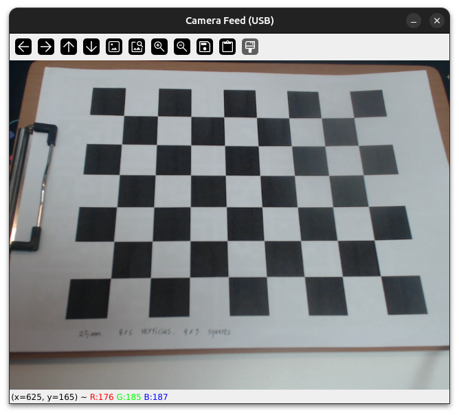
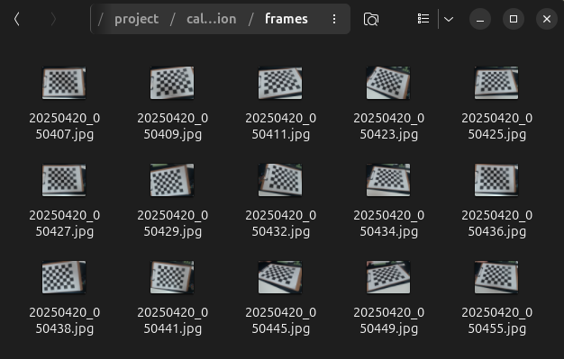
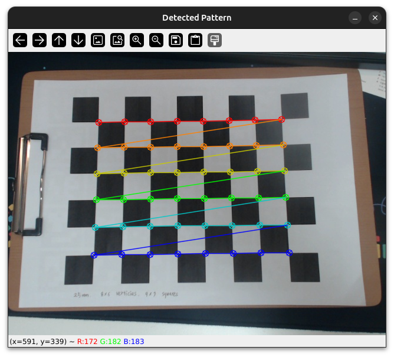
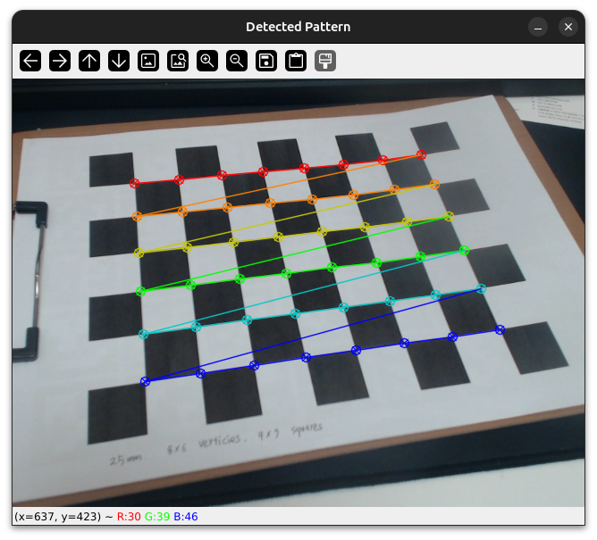
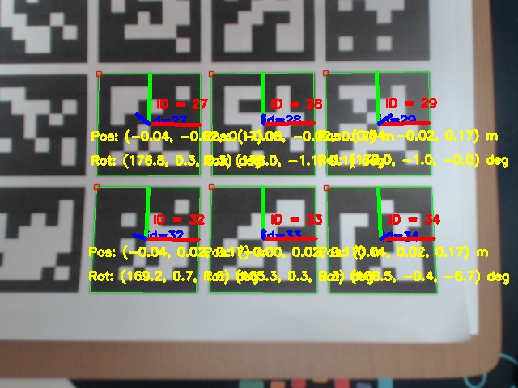
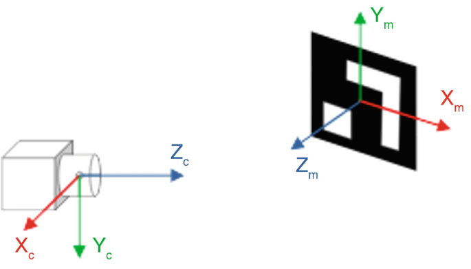
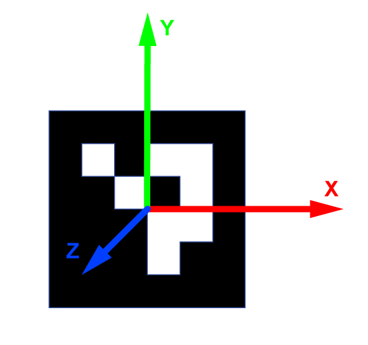

# 0. 패키지 설치
```bash
pip install opencv-contrib-python opencv-python pyyaml numpy
```

# 1. 캘리브레이션할 카메라 실행
```bash
python stream_camera.py --source usb --camera_index 0
# or
python stream_camera.py --source udp --udp_id <udp_ip> --udp_port <udp_port>
```



# 2. `s`를 눌러 `./frames`에 체커보드 촬영한 이미지 저장



# 3. 캘리브레이션 실행
`camera_param.yaml`에 저장
```bash
python camera_calibration.py --size 8x6 --square 0.025

# Options:
# --size: 체커보드 내부 코너 개수 (가로x세로)
# --square: 체커보드 한 칸의 실제 크기 (meter)
# --path: 이미지 저장 경로 (default = "./frames")
```
 | 


# 4. 아르코 마커로 확인
```bash
python stream_camera.py --source usb --camera_index 0 \
                        --calibration --parameter camera_param.yaml \
                        --aruco_type DICT_6X6_250 --aruco_length 0.035
# or
python stream_camera.py --source udp --udp_id <udp_ip> --udp_port <udp_port> \
                        --calibration --parameter camera_param.yaml \
                        --aruco_type DICT_6X6_250 --aruco_length 0.035       
```




---

